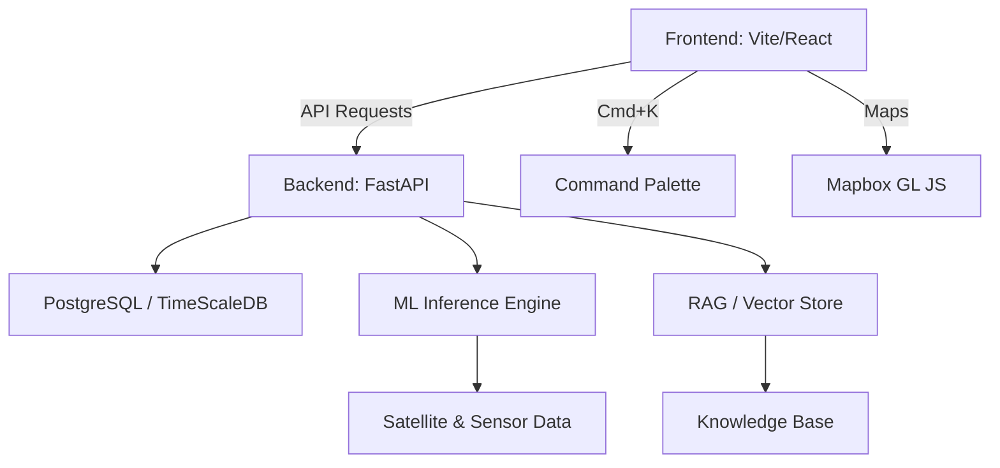

# <div align="center"> <br/> AgriX Intelligence Platform</div>

<div align="center">
  <h3>Next-Generation AI for Precision Agriculture</h3>
  <p>A production-ready SaaS ecosystem transforming raw agricultural data into actionable intelligence.</p>

  [](https://vitejs.dev/)
  [](https://tailwindcss.com/)
  [](https://fastapi.tiangolo.com/)
  [](https://www.python.org/)
</div>

---

## 🛰️ System Overview

**AgriX** is an end-to-end intelligence platform that integrates satellite telemetry, weather forecasting, and machine learning to optimize global crop yields. Built with a focus on **visual excellence** and **data precision**, it provides a world-class experience for modern agronomists.

### 💎 Key Visual Pillars
- **Apple-Inspired Aesthetic:** Clean, light-minimal interface with glassmorphism and subtle micro-animations.
- **Data-First Design:** Interactive Recharts & Mapbox GL JS visualizations.
- **Intelligent Navigation:** Cmd+K Command Palette for lightning-fast workflow transitions.

---

## 🎨 Professional Dashboard

The heart of AgriX is a multi-layered dashboard designed for high-density information clarity.


### 📊 Core Modules

| Module | Description | Technologies |
| :--- | :--- | :--- |
| **Yield Lab** | ML-driven yield prediction & crop optimization. | Scikit-learn, XGBoost |
| **Geospatial** | Satellite NDVI analysis & productivity heatmaps. | Mapbox GL, GeoPandas |
| **AI Assistant** | RAG-powered agronomy knowledge engine. | LangChain, FAISS |
| **Climate Hub** | High-precision weather impact forecasting. | ARIMA, Prophet |
| **Asset Manager** | Real-time fleet & task tracking. | React State Management |

---

## 🏗️ Architecture



---

## 🚀 Advanced Features

### 🌾 Field & Crop Intelligence
Dynamic field cards provide real-time telemetry including soil moisture, NDVI health indices, and harvest countdowns.


### 🤖 RAG-Powered AI Assistant
Get expert agronomic advice instantly. Our AI parses through scientific datasets to provide contextualized answers for pest control, fertilization, and growth optimization.


### 📈 Financial & Predictive Analytics
Track seasonal ROI, revenue vs. expenses, and yield trends with production-grade data visualizations.


---

## 🛠️ Performance Features
- **HSL Design System:** Centralized color tokens for consistent styling.
- **Lazy Loading:** All pages are chunked and loaded on-demand for instant FCP.
- **Skeleton States:** Smooth loading transitions for all data-heavy widgets.
- **Error Boundaries:** Resilient UI that recovers gracefully from segment-level failures.

---

## 📡 Deployment & Scale
The system is containerized for cloud-scale deployment using **Docker Compose**.

```bash
# Spin up the entire intelligence stack
cd docker
docker compose up --build -d
```

---

<div align="center">
  <p>© 2026 AgriX Intelligence. Built for the future of food security.</p>
</div>
